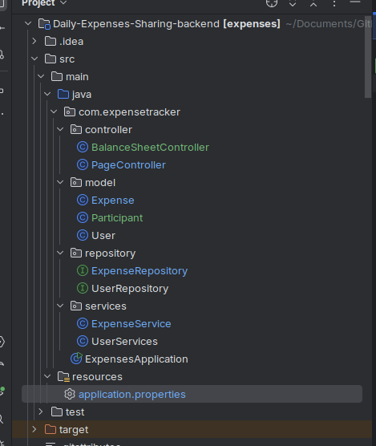
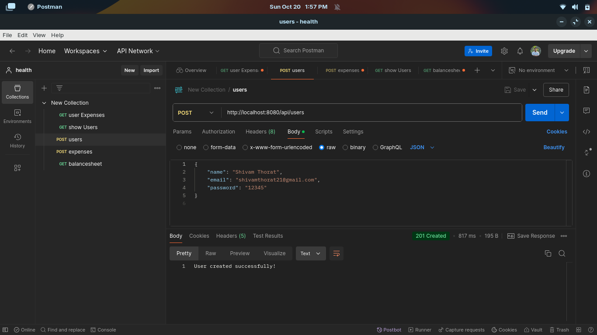
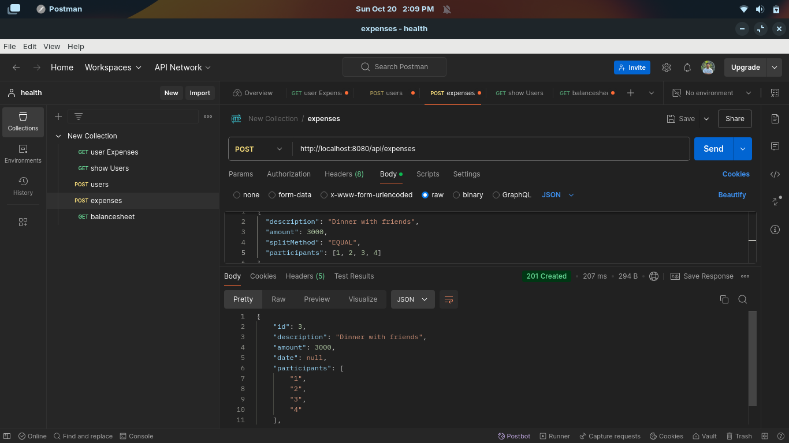
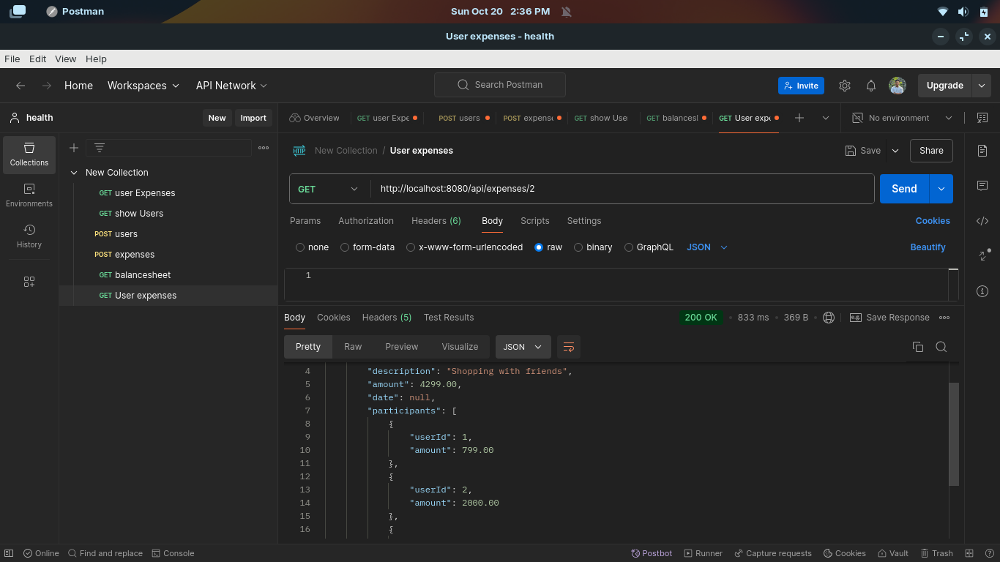
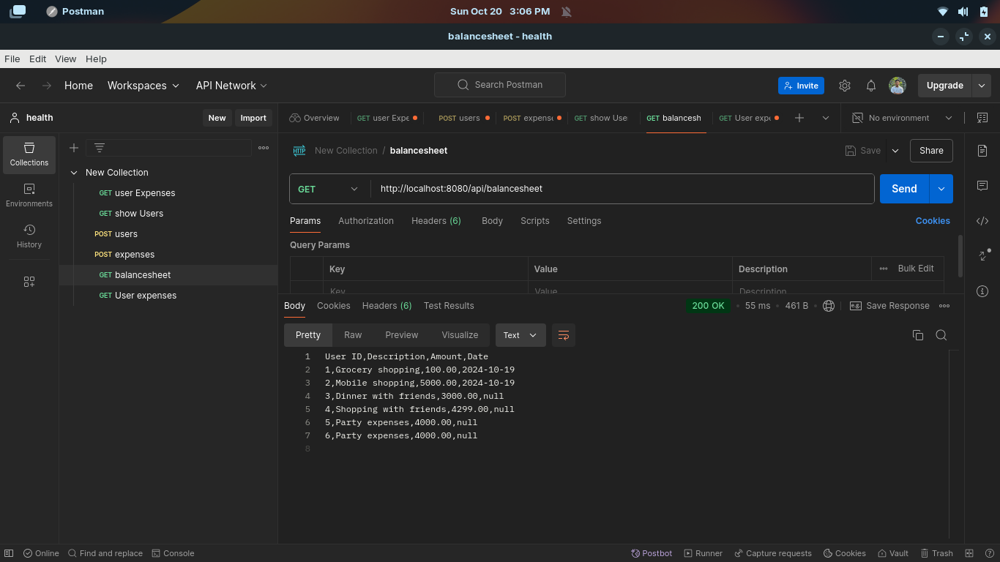

# Daily Expenses Sharing Application

## Overview

The **Daily Expenses Sharing Application** is a web-based platform designed to help users efficiently manage and track their daily expenses. This application simplifies financial management by allowing users to split expenses using multiple methods and review their spending patterns. Users can also generate downloadable balance sheets for easy offline analysis.

---

## Features

- **User Management**:
    - Register new users.
    - Retrieve user details.

- **Expense Tracking**:
    - Add new expenses with descriptions, amounts, and dates.
    - View all expenses for a specific user or the entire group.

- **Expense Splitting**:
    - **Equal**: Split expenses equally among participants.
    - **Exact**: Specify the exact amount each participant owes.
    - **Percentage**: Allocate expenses based on participant-defined percentages.

- **Balance Sheet Generation**:
    - Download a CSV file containing all expenses for offline review.

---

## Expense Calculation Examples

1. **Equal Split**  
   **Scenario**: You go out with 3 friends, and the total bill is 3000.  
   **Result**: Each person owes 1000.

   **Example JSON (API Input)**:
   ```json
   {
     "totalAmount": 3000,
     "participants": ["Friend1", "Friend2", "Friend3", "You"],
     "splitMethod": "equal"
   }
   ```

1. **Exact Split**  
   **Scenario**: You go shopping with 2 friends, and the total bill is 4299.
   - Friend 1 owes 799, Friend 2 owes 2000, and you owe 1500.

   **Example JSON (API Input)**:
   ```json
   {
     "totalAmount": 4299,
     "participants": [
        { "name": "Friend1", "amount": 799 },
        { "name": "Friend2", "amount": 2000 },
        { "name": "You", "amount": 1500 }
     ],
    "splitMethod": "exact"
   }
    ```

1. **Percentage Split**  
   **Scenario**: You attend a party with 2 friends and a cousin.  
    - You owe 50%, Friend 1 owes 25%, and Friend 2 owes 25%.

   **Example JSON (API Input)**:
   ```json
   {
     "totalAmount": 5000,
     "participants": [
          { "name": "You", "percentage": 50 },
          { "name": "Friend1", "percentage": 25 },
          { "name": "Friend2", "percentage": 25 }
     ],
     "splitMethod": "percentage"
   }
   ```


## Technologies Used

- **Backend**: Spring Boot
- **Database**: MySQL
- **Java Version**: 17
- **Dependencies**:
    - Spring Boot Starter Data JPA
    - Spring Boot Starter Thymeleaf
    - MySQL Connector/J
    - Lombok
    - Spring Security (optional for authentication)

## Getting Started


### Installation

1. **Clone the repository**
   ```bash
   git clone https://github.com/yourusername/expenses.git 
   cd expenses
    ```
       

2. **Set up MySQL Database**

- Create a new MySQL database named expenses:
  ```bash
  CREATE DATABASE expenses;     
  ```


2. **Update the application.properties file with your MySQL credentials.**:
    ```bash
    spring.datasource.url=jdbc:mysql://localhost:3306/expenses
    spring.datasource.username=your_username
    spring.datasource.password=your_password
    ```
3. **Build and run the application**:
   ```bash
    mvn clean install
    mvn spring-boot:run
    ```
The application will start on ``` http://localhost:8080.```

# Postman Collection

This repository contains a Postman collection for the Daily Expenses Sharing Application.

## How to Use

1. Import the collection into Postman. ```ExpensesTracker.postman_collection.json``` file
2. Set up the environment variables if needed.
3. Run the API requests as required.


## Testing with Postman

Here’s how you can test the API endpoints using Postman.

1. **Launch Postman**
   - Download and install Postman from <a href="https://www.postman.com/">here</a> if you don't have it installed.

   ### 1. User Registration
        
    

   ### 2. Add an Expense

    

   ### 3.  View All Expenses of a User

    

   ### 4.  Download Balance Sheet

    

### Evaluation Criteria
1. **Correctness:** Functional API with all endpoints working as expected.
2. **Code Quality:** Clean, well-documented, and modular code.
3. **Documentation:** Clear instructions and comments.
4. **Bonus:** JWT Authentication, Error Handling, Tests, and Optimizations.
   (I haven't added JWT yet, but it can be integrated when creating the application.)


This design ensures a clean, maintainable backend with a focus on functionality, validation, and extensibility. Let me know if you'd like further customization.
